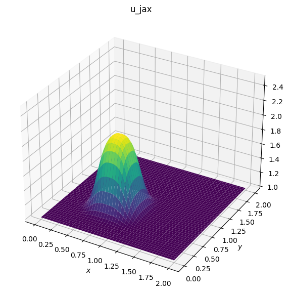

Step 16: 2D Diffusion Equation using Numpy and JAX
----
***

In this step, we will revise the code from Step 9, which addresses solving the 2D Diffusion Equation, adapting it to utilize JAX. Our focus will be on comparing the computational performance of Numpy and JAX in terms of execution time.


```python
from mpl_toolkits.mplot3d import Axes3D
import numpy as np
from matplotlib import pyplot as plt, cm

#variables declarations

nx = 1001
ny = 1001
nt = 5000
nu = 0.05
dx = 2 / (nx - 1)
dy = 2 / (ny - 1)
sigma = 0.2
dt = sigma * dx * dy / nu

```


```python
def diffusion_numpy(u,nt,dx,dy,nu,dt):

    # loop across number of time steps
    for n in range(nt):
        un = u.copy()
        u[1:-1, 1:-1] = (un[1:-1, 1:-1] +
                        nu * dt / dx**2 *
                        (un[2:,1:-1] - 2 * un[1:-1, 1:-1] + un[0:-2,1:-1]) +
                        nu * dt / dy**2 *
                        (un[1:-1,2:] - 2 * un[1:-1, 1:-1] + un[1:-1,0:-2]))
        u[0,:] = 1
        u[-1,:] = 1
        u[:,0] = 1
        u[:,-1] = 1

    return u
```


```python
# A = np.zeros((5,5))
# def A_change(A):
#   A[0,0] = 1
#   return A
# print(A)
# B = A_change(A)
# print(A)  ## A will be changed
# print(B)
```


```python
# A = jnp.zeros((5,5))
# def A_change(A):
#   A.at[0,0].set(1)
# print(A)
# A_change(A)
# print(A)  ## A will NOT be changed!
```


```python
import jax.numpy as jnp
from jax import grad, jit, vmap
from functools import partial
```


```python
@partial(jit, static_argnums=(1,2,3,4,5))
def stepper(u,nt,dx,dy,nu,dt):
  u = u.at[1:-1, 1:-1].set((u[1:-1, 1:-1] +
                        nu * dt / dx**2 *
                        (u[2:,1:-1] - 2 * u[1:-1, 1:-1] + u[0:-2,1:-1]) +
                        nu * dt / dy**2 *
                        (u[1:-1,2:] - 2 * u[1:-1, 1:-1] + u[1:-1,0:-2])))
  # Bounday conditions
  u = u.at[0,:].set(1)
  u = u.at[-1,:].set(1)
  u = u.at[:,0].set(1)
  u = u.at[:,-1].set(1)
  return u
```


```python
def diffusion_jax(u,nt,dx,dy,nu,dt):

  for n in range(nt):
    u = stepper(u,nt,dx,dy,nu,dt)

  return u
```

### Run the diffusion_numpy


```python
x = np.linspace(0,2,nx)
y = np.linspace(0,2,nx)
X, Y = np.meshgrid(x,y)
## inital conditions
u_numpy = np.ones((nx,ny))

# set hat function I.C.: u(0.5<=x<=1 && 0.5<=y<=1) = 2
u_numpy[int(0.5/dx):int(1/dx+1),int(0.5/dy):int(1/dy+1)] = 2

#%timeit diffusion_numpy(u_numpy,nt,dx,dy,nu,dt)
%time u_numpy = diffusion_numpy(u_numpy,nt,dx,dy,nu,dt)

# Plotting u_numpy
fig1 = plt.figure(figsize=(11, 7), dpi=100)
ax1 = fig1.add_subplot(111, projection='3d')
surf1 = ax1.plot_surface(X, Y, u_numpy, cmap=cm.viridis)
ax1.set_zlim(1, 2.5)
ax1.set_xlabel('$x$')
ax1.set_ylabel('$y$');
ax1.set_title('u_numpy')

```

    CPU times: user 58.8 s, sys: 16.7 s, total: 1min 15s
    Wall time: 1min 18s


    Text(0.5, 0.92, 'u_numpy')


    

    


### Run the diffusion_jax


```python
u_jax = jnp.ones((nx,ny)) # create 2d array of 1's
## initial conditions

# set hat function I.C.: u(0.5<=x<=1 && 0.5<=y<=1) = 2
u_jax = u_jax.at[int(0.5/dx):int(1/dx + 1), int(0.5/dy):int(1/dy + 1)].set(2)
#The .at interface allows for a more familiar and compact notation,
#while preserving the immutable array semantics of JAX.


%time u_jax = diffusion_jax(u_jax,nt,dx,dy,nu,dt)

# Plotting u_jax
fig2 = plt.figure(figsize=(11, 7), dpi=100)
ax2 = fig2.add_subplot(111, projection='3d')

surf2 = ax2.plot_surface(X, Y, u_jax, cmap=cm.viridis)
ax2.set_zlim(1, 2.5)
ax2.set_xlabel('$x$')
ax2.set_ylabel('$y$');
ax2.set_title('u_jax')
```

    CPU times: user 822 ms, sys: 258 ms, total: 1.08 s
    Wall time: 1.03 s


    Text(0.5, 0.92, 'u_jax')


    

    


The comparison reveals a significant performance enhancement: the JAX version, when run on GPUs, is approximately **80 times faster** than the Numpy version. This improvement dramatically reduces the execution time from 80 seconds to just 1 second!


```python

```
